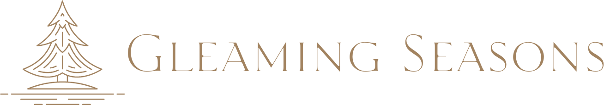

    

This repository contains the source code for the [Gleaming Seasons](https://gleamingseasons.com) website.

---

## Overview

This is a static website built for the company **Gleaming Seasons**. The codebase includes HTML, CSS, and minimal JavaScript to power the public-facing site.

---

## License

> The **code** in this repository is licensed under the [MIT License](./LICENSE).

However, **all branding and content** — including but not limited to:

- The Gleaming Seasons name and logo
- Text content and written copy
- Images, graphics, and videos
- Color palette, icons, and other design elements

are the exclusive property of **Gleaming Seasons** and **may not be reused, copied, or modified without explicit permission.**

---

© 2024-2025 Gleaming Seasons. All rights reserved.
